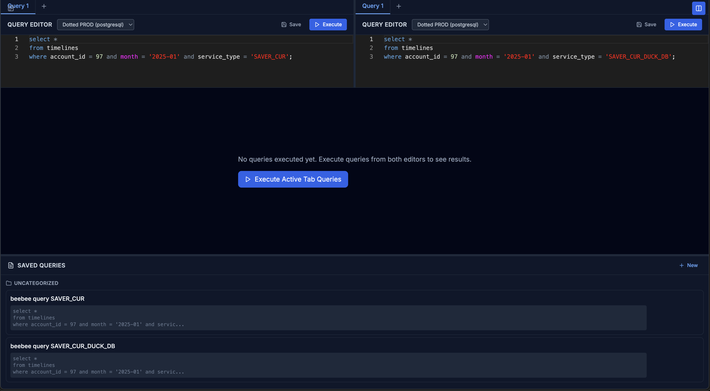

# Browser SQL IDE

Web SQL IDE built with Next.js for managing connections, running queries, editing results, and comparing outputs side by side.

Current connectors: PostgreSQL, SQLite (uploaded file), and Turso/libSQL.



## What is implemented

- Connection manager with create/edit/delete/test, default connection, import/export JSON, and color tags.
- PostgreSQL metadata explorer in the sidebar:
  - Databases
  - Schemas and schema objects (tables/views)
  - Event triggers
  - Extensions
  - Storage (tablespaces)
  - System info
  - Roles
- Tabbed query editor (Monaco) with per-tab connection selection, rename/duplicate/reorder tabs, and local persistence.
- Keyboard execution shortcut (`Ctrl+Enter` or `Cmd+Enter`) with SQL error line highlighting.
- Split-screen mode with two independent editors.
- Compare mode between split-screen results with selectable key columns and optional field-level comparison, plus CSV export.
- Result grid with:
  - Pagination + infinite scroll
  - CSV export
  - SQL INSERT export and INSERT file import
  - "Insert into another connection"
  - Inline edit mode (add/update/delete rows) with generated SQL preview and save.
- Saved queries with folders/description, duplicate, run, edit, and delete.
- Query execution history stored by API.

## Tech stack

- Next.js 14 (App Router), React 18, TypeScript
- Next.js Route Handlers (Node runtime)
- SQLite (`better-sqlite3`) for app metadata (`data/ide.db`)
- Connectors:
  - PostgreSQL via `pg`
  - SQLite via `better-sqlite3`
  - Turso/libSQL via `@libsql/client`
- Tailwind CSS + Lucide icons
- Monaco editor (`@monaco-editor/react`)
- AES credential encryption (`crypto-js`)

## Requirements

- Node.js 18+
- npm
- Optional: running PostgreSQL and/or Turso database if you want those connectors

## Quick start

```bash
git clone <repository-url>
cd browser-sql-ide
npm install
```

Create `.env.local` (recommended):

```env
ENCRYPTION_KEY=replace-with-a-strong-random-secret
```

Run:

```bash
npm run dev
```

Open [http://localhost:3000](http://localhost:3000).

## Local data and files

- App metadata DB: `data/ide.db`
- Uploaded SQLite files: `data/sqlite/`
- Connection credentials are stored encrypted in `data/ide.db`.

## API reference

### Connections

- `GET /api/connections`
- `POST /api/connections`
- `GET /api/connections/[id]`
- `PUT /api/connections/[id]`
- `DELETE /api/connections/[id]`
- `POST /api/connections/[id]/test`
- `POST /api/connections/test`
- `GET /api/connections/[id]/metadata?category=<category>`

Metadata categories:

- `databases`
- `schemas`
- `schema_objects` (requires `schema` query param)
- `event_triggers`
- `extensions`
- `storage`
- `system_info`
- `roles`

### Saved queries

- `GET /api/queries`
- `POST /api/queries`
- `GET /api/queries/[id]`
- `PUT /api/queries/[id]`
- `DELETE /api/queries/[id]`

### Query execution

- `POST /api/query/execute`
- `POST /api/query/paginate`

### History

- `GET /api/history` (supports `connectionId` and `limit`)

## Notes and limitations

- Metadata endpoint is PostgreSQL-only.
- Connection JSON export does not include passwords/tokens for security.
- Importing connections from JSON works for PostgreSQL/Turso payloads; SQLite connection creation requires a file upload.
- There is no auth layer yet; this should be treated as a trusted/internal admin tool.

## Scripts

```bash
npm run dev
npm run build
npm run start
npm run lint
npm test
```

## Project structure

```text
src/
  app/
    (main)/                 # Main UI
    api/                    # Route handlers
  components/
    features/               # Feature modules (connections, editor, results, etc.)
    ui/                     # Shared UI primitives
  lib/                      # DB access, encryption, connectors
  styles/
  types/
data/                       # Local runtime data (ide.db, sqlite uploads)
```

## License

MIT
